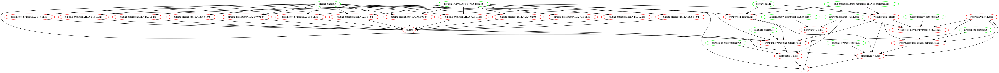

# bianchi_et_al_2017

Branch   |[](https://travis-ci.org)
---------|----------------------------------------------------------------------------------------------------------------------------------------------------------
`master` |[](https://travis-ci.org/richelbilderbeek/bianchi_et_al_2017)
`develop`|[](https://travis-ci.org/richelbilderbeek/bianchi_et_al_2017)

R code for 'Transmembrane Helices Are an Overlooked Source
of Major Histocompatibility Complex Class I Epitopes',
by Frans Bianchi, Johannes Textor and Geert van den Bogaart.

These R scripts make almost all figures in the paper
"Transmembrane helices are an overlooked source of MHC class I epitopes"
by Frans Bianchi, Johannes Textor, and Geert van den Bogaart.
(DOI: 10.3389/fimmu.2017.01118)

Figure 3 is made by [tmh-predictions/HLA_predictions.xlsx](tmh-predictions/HLA_predictions.xlsx).

## Usage

If you have all prerequisites installed,
you should be able to create all figures by typing `make`.
All necessary data will either be downloaded (such
as the human proteome) or is included in the folder `data/` (such as the
transmembrane domain predictions).

### Run test

```
make test
```

### Run full

```
make
```

Be aware that the HLA binding predictions can take several hours. It can
be useful to speed up the process by running e.g. 'make -j 8' to run 8
jobs in parallel.

## Prerequisites

To run the code, you need:

* A working R installation and the R packages `seqinr` and `data.table`
* The R package `EpitopePrediction`, which can be installed from github
  using `remotes::install_github("jtextor/epitope-prediction")`
* GNU Make
* The program `wget`

If you do not have the program `wget` or do not wish to install it, you
can also download the human proteome yourself and store it in the folder
'proteome/' before typing 'make'.

## Files

The folder 'data' contains two files with peptide sequences that were
eluted from B lymphoblastoid cell lines. These sequences are taken from
the following publication, which is also cited in our paper:

"Comprehensive analysis of the naturally processed peptide repertoire:
 differences between HLA-A and B in the immunopeptidome"
by Schellens et al, PLoS One (2015) 10:e0136417.
(DOI: 10.1371/journal.pone.0136417)

## Open questions

* [Where does 'trans-membrane-analysis-shortened.txt' come from?](https://github.com/richelbilderbeek/bianchi_et_al_2017/issues/4)

## Makefile as a call graph



## Create graph

```
make pic
```

## Downloads

* [Re-run done at 2020-09-29](http://richelbilderbeek.nl/bianchi_et_al_2017_20200929.zip)

Human proteome:

* Full proteome: download from:
  [here](https://www.ebi.ac.uk/reference_proteomes/),
  direct download from [here](ftp://ftp.ebi.ac.uk/pub/databases/reference_proteomes/QfO/Eukaryota/UP000005640_9606.fasta.gz),
  or use `bianchietal2017::download_proteome`
* Full proteome without selenocysteines:
  download from: [http://richelbilderbeek.nl/UP000005640_9606_no_u.fasta](http://richelbilderbeek.nl/UP000005640_9606_no_u.fasta),

Topology of human proteome:

* TMHMM topology of full proteome: impossible, due to selenocysteines,
  else it would be
  [here](http://richelbilderbeek.nl/UP000005640_9606.tmhmm)
* TMHMM topology of full proteome without selenocysteines: at [http://richelbilderbeek.nl/UP000005640_9606_no_u.tmhmm](http://richelbilderbeek.nl/UP000005640_9606_no_u.tmhmm)
* PureseqTM topology:
  [here](https://www.richelbilderbeek.nl/UP000005640_9606.pureseqtm) [1]

## References

* [1] Changed the predicted topology of `TRDD1_HUMAN` from `[nothing]`
  to `00` (i.e. cytosolic)
